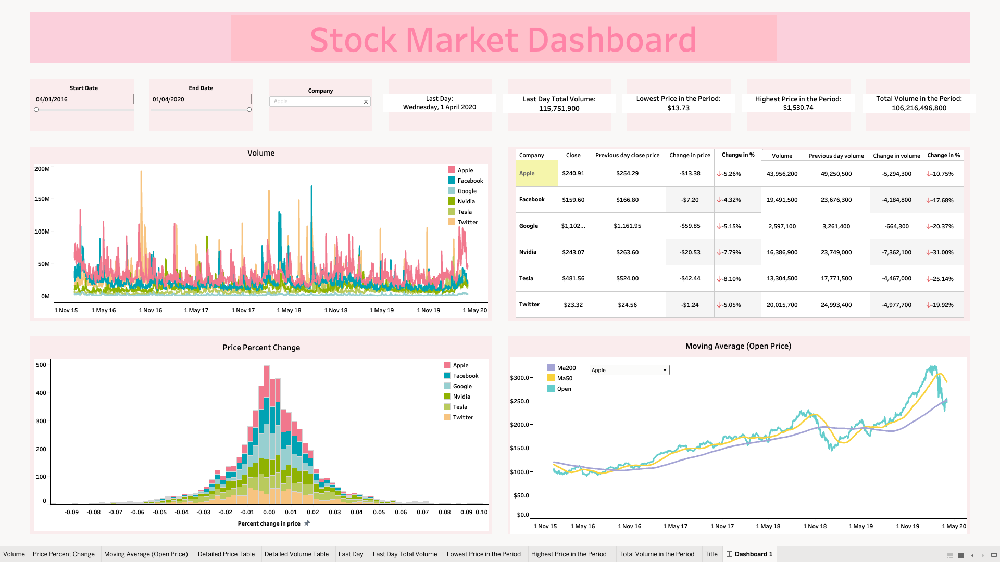

# Stock Market Analysis Dashboard

## Overview
This project focuses on analyzing stock market data from five major tech companies—Apple, Facebook, Google, Nvidia, Tesla, and Twitter—between 2016 and 2020. The analysis leverages Python for data preprocessing in a Jupyter Notebook and visualizes key insights using Tableau.

## Project Components

### 1. [Tableau Public Dashboard](<[Your Tableau Public Link Here](https://public.tableau.com/views/Dashboard_17246876197530/Dashboard1?:language=en-GB&:sid=&:redirect=auth&:display_count=n&:origin=viz_share_link)>)
This interactive dashboard allows users to explore stock market trends, including volume traded, price changes, and moving averages. Users can filter the data by company and date to observe specific trends in stock performance.

- **Key Visualizations:**
  - **Volume Traded**: A time-series line chart showing the daily trading volume for each company.
  - **Price Percent Change**: A histogram depicting the distribution of daily percentage price changes.
  - **Moving Averages**: A chart comparing different moving averages (MA50 and MA200) for company stocks.
  - **Price and Volume Change Table**: Displays daily price and volume changes for each company.

### 2. [Jupyter Notebook: Stock Data Preprocessing](Stock_Data_Preprocessing.ipynb)
This notebook handles the preprocessing of the stock market dataset, which was sourced from [Kaggle](https://www.kaggle.com/datasets/jacksoncrow/stock-market-dataset). The notebook includes the following steps:
  
- **Data Loading**: Importing the dataset and performing initial checks for missing or inconsistent data.
- **Data Cleaning**: Removing null values and correcting any inconsistencies in the data.
- **Feature Engineering**: Creating additional columns for easier analysis, such as daily percentage price changes and moving averages.
- **Data Preparation for Tableau**: Filtering and exporting cleaned data to be used in Tableau for visualization.

## Data Source
- **Dataset**: Stock Market Dataset (S&P 500) by Jackson Crow, sourced from Kaggle. Available [here](https://www.kaggle.com/datasets/jacksoncrow/stock-market-dataset).
- The dataset contains daily price and volume information for multiple companies, enabling multi-year trend analysis.

## Technologies Used
- **Python**: Data preprocessing in Jupyter Notebook (pandas, numpy).
- **Tableau**: Visualizations and interactive dashboards.
- **Data Source**: Kaggle stock market dataset.

## How to Use
1. **Jupyter Notebook**: Open the notebook (`Stock_Data_Preprocessing.ipynb`) in your local environment to review the data preprocessing steps. This file prepares the data for visualization in Tableau.
2. **Tableau Public Dashboard**: View the interactive dashboard on [Tableau Public](<(https://public.tableau.com/views/Dashboard_17246876197530/Dashboard1?:language=en-GB&:sid=&:redirect=auth&:display_count=n&:origin=viz_share_link)>) to explore the stock market trends and insights.

## Future Improvements
I would love to keep working on this project and take it further! Here are some things I hope to add soon:
- Expand the analysis to include additional stock metrics such as relative strength index (RSI) or Bollinger Bands.
- Integrate real-time stock data for more up-to-date insights.
